# AI-Powered Internship Recommendation Engine

An intelligent match-making portal built under the guidelines of the **Prime Minister's Internship Scheme**, designed to automatically parse student resumes, analyze skill gaps, and match candidates with the most relevant internship opportunities.

---

## 📊 Project Workflow

Below is the visual architecture detailing the resume processing pipeline and recommendation scoring engine:

```mermaid
graph TD
    subgraph "1. Resume Parsing & Autofill Pipeline"
        A[Upload PDF Resume] --> B{Text Extractor}
        B -->|pdfplumber / fitz / pypdf| C[Raw Resume Text]
        C --> D{Gemini API Key Set?}
        D -->|Yes| E[Gemini AI Parser]
        D -->|No| F[Local Heuristic Parser]
        E --> G[Structured JSON]
        F --> G
        G --> H[Skill Normalization & Deduplication]
        H --> I[Autofill Preview Modal]
        I -->|User Approves Fields| J[Form Inputs Updated]
        J -->|Save Profile| K[Commit to SQLite Database]
    end

    subgraph "2. Recommendation Match Scoring Engine"
        L[Candidate Profile] --> P{Match Engine}
        M[Internships DB] --> P
        P -->|TF-IDF Vectorization| N[Semantic Cosine Similarity 20%]
        P -->|Skills Overlap| O[Skills Match Score 40%]
        P -->|Eligibility Criteria| Q[Structured Match Score 40%]
        N --> R[Weighted Hybrid Match Score]
        O --> R
        Q --> R
        R --> S[Generate Score Breakdown & Explanation]
    end
```



---

## 🚀 Key Features

### 1. AI-First Resume Parser
* **Multi-stage Extraction**: Parses PDF resumes using a robust pipeline of `pdfplumber`, `PyMuPDF`, and `pypdf`.
* **Gemini AI Integration**: Extracts structured profile data (JSON) directly from resume text using Gemini models with strict validation and no hallucinations.
* **Deterministic Local Fallback**: Safely falls back to an advanced regex-based parser if the API key is not configured.

### 2. Smart Autofill & Preview
* **Side-by-Side Verification**: Displays a premium comparison modal showing **Current Profile Value ➔ Detected Value** for each field.
* **Confidence Scoring**: Assigns a confidence value to every parsed field; automatically ticks high-confidence fields ($\ge 70\%$) and alerts users on low-confidence ones.
* **Smart Merging**: Intelligently updates skills (replaces old ones with normalized new ones) and merges interests instead of blindly overwriting.

### 3. Hybrid ML Recommendation Engine
* **Semantic Analysis**: Computes TF-IDF vector embeddings and Cosine Similarity scores matching profile keywords against internship descriptions.
* **Structured Eligibility Matching**: Combines semantic matching with strict filters for academic branch, degree, CGPA, location preferences, and target industry.
* **Explainable AI (XAI)**: Displays a clear, percentage-based score breakdown explaining how the match percentage (e.g. 83%) was calculated.

### 4. Interactive Student & Admin Portals
* **Student Portfolio**: View, track, and apply for matched opportunities, save bookmarks, and follow custom week-by-week learning roadmaps for missing skills.
* **Admin Dashboard**: System-wide analytics on student registration, skill demands, and work-mode distributions utilizing interactive Chart.js visualization.

---

## 🛠️ Tech Stack

* **Backend**: Python, Flask, Flask-SQLAlchemy (SQLite)
* **Frontend**: HTML5, Vanilla CSS3 (Slate-Ocean Premium Theme), JavaScript (SPA architecture)
* **AI / ML**: Google Gemini API (`google-genai`), Scikit-Learn (`TfidfVectorizer`), NumPy
* **PDF Extraction**: `pdfplumber`, `pypdf`, `pymupdf`

---

## 📦 Installation & Setup

### 1. Clone the Repository
```bash
git clone https://github.com/jiyanarwani/Internship-Recommendation-Engine.git
cd Internship-Recommendation-Engine
```

### 2. Install Dependencies
Ensure you have Python 3.10+ installed. Install the required libraries:
```bash
pip install flask flask_sqlalchemy scikit-learn numpy pdfplumber pypdf google-genai python-dotenv
```
*(Note: If you run into DLL issues with PyMuPDF on locked Windows environments, the parser will automatically bypass it and fall back to pdfplumber.)*

### 3. Set Up Environment Variables (Optional)
To use the Gemini AI parser, create a `.env` file in the root folder or set the environment variable:
```env
GEMINI_API_KEY=your_google_gemini_api_key_here
```

### 4. Initialize and Seed the Database
Initialize tables and populate default internships, admin logins, and mock students:
```bash
python seed.py
```

### 5. Run the Application
Start the Flask local development server:
```bash
python app.py
```
Open **`http://127.0.0.1:5000`** in your browser to view the application.

---

## 👥 Seed Credentials (Default)

* **Candidate Login**:
  * Email: `student@pm-internship.gov.in`
  * Password: `student123`
* **Administrator Login**:
  * Email: `admin@pm-internship.gov.in`
  * Password: `admin123`

---

## 🔒 License
This project is open-source and licensed under the MIT License.
